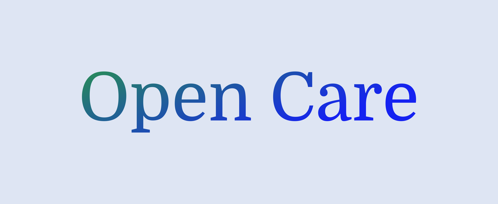

# Open-Care

<div align="center">
  <a href="https://github.com/othneildrew/Best-README-Template">
    
  </a>

<h3 align="center">Open-Care</h3>

  <p align="center">
    Empowering communities with free access to medical information for healthier lives!
    <br />
    <a href="#getting-started"><strong>Get Started »</strong></a>
    <br />
    <br />
    <a href="https://opencarebd.com/">View Live Demo</a>
    ·
    <a href="http://46.102.157.211:6700/swagger-ui/index.html">API Documentation</a>
    ·
    <a href="https://github.com/Cipher-Text/opencare/issues">Report Bug</a>
    ·
    <a href="https://github.com/Cipher-Text/opencare/issues">Request Feature</a>
  </p>

[![Contributors][contributors-shield]][contributors-url]
[![Forks][forks-shield]][forks-url]
[![Stargazers][stars-shield]][stars-url]
[![Issues][issues-shield]][issues-url]
[![MIT License][license-shield]][license-url]
[![LinkedIn][linkedin-shield]][linkedin-url]
</div>

## 📖 Table of Contents

<details>
  <summary>Click to expand</summary>
  <ol>
    <li><a href="#about-the-project">About The Project</a></li>
    <li><a href="#key-features">Key Features</a></li>
    <li><a href="#repositories">Repositories</a></li>
    <li><a href="#live-demo--api">Live Demo & API</a></li>
    <li><a href="#tech-stack">Tech Stack</a></li>
    <li><a href="#architecture">Architecture</a></li>
    <li><a href="#getting-started">Getting Started</a></li>
    <li><a href="#usage">Usage</a></li>
    <li><a href="#api-reference">API Reference</a></li>
    <li><a href="#roadmap">Roadmap</a></li>
    <li><a href="#contributing">Contributing</a></li>
    <li><a href="#contributors">Contributors</a></li>
    <li><a href="#license">License</a></li>
    <li><a href="#contact">Contact</a></li>
    <li><a href="#acknowledgments">Acknowledgments</a></li>
  </ol>
</details>

## 🩺 About The Project

[![Product Screenshot][product-screenshot]](https://opencarebd.com/)

Open-Care is a comprehensive medical information platform designed to democratize access to healthcare resources. In a world where medical knowledge should be accessible to all, our platform serves as a bridge between healthcare professionals and the communities they serve.

The healthcare landscape is rapidly evolving with new research, treatments, and medical guidelines emerging constantly. Open-Care addresses the critical need for a centralized, reliable source of medical information that empowers both healthcare providers and patients with accurate, evidence-based resources.

### 🎯 Mission
To create an inclusive healthcare ecosystem where accurate medical information, qualified healthcare providers, and trusted medical facilities are accessible to everyone, regardless of their geographical or economic constraints.

## ✨ Key Features

### 👨‍⚕️ **Doctor Directory**
- **Comprehensive Database**: Access detailed profiles of healthcare professionals
- **Advanced Search**: Find doctors by specialty, location, experience, and ratings
- **Verified Credentials**: All medical professionals are verified for authenticity
- **Contact Integration**: Direct contact information and appointment booking capabilities
- **Patient Reviews**: Community-driven feedback system for quality assurance

### 🏥 **Hospital Database**
- **Facility Information**: Detailed hospital profiles with services, facilities, and specializations
- **Location-Based Search**: Find nearby hospitals using geolocation
- **Service Mapping**: Search hospitals by specific medical services and treatments
- **Quality Ratings**: Community and professional ratings for informed decisions
- **Real-time Updates**: Current availability, emergency services, and contact information

### 🔍 **Advanced Information Search**
- **Medical Knowledge Base**: Curated collection of medical articles, research papers, and guidelines
- **Smart Search Engine**: AI-powered search with medical terminology recognition
- **Evidence-Based Content**: All information sourced from peer-reviewed medical literature
- **Regular Updates**: Content continuously updated with latest medical research
- **Multi-language Support**: Accessible content in multiple languages (planned)

### 📱 **Cross-Platform Access**
- **Web Application**: Responsive design for desktop and mobile browsers
- **Mobile App**: Native mobile application for iOS and Android
- **Offline Support**: Critical information available offline for emergency situations
- **Accessibility Features**: Designed with accessibility standards for inclusive usage

## 📁 Repositories

This project is organized into separate repositories for better maintainability and deployment:

| Repository | Description | Technologies | Status |
|------------|-------------|--------------|--------|
| **[Frontend Repository](https://github.com/Cipher-Text/open-care-frontend)** | Next.js web application with modern UI/UX | Next.js, React, TailwindCSS, TypeScript | ✅ Active |
| **[Backend Repository](https://github.com/Cipher-Text/open-care-backend)** | RESTful API server with comprehensive medical data management | Java, Spring Boot, PostgreSQL, Swagger | ✅ Active |
| **[Mobile Repository](https://github.com/Cipher-Text/open-care-mobile)** | Cross-platform mobile application | React Native, TypeScript, Expo | ✅ Active |

## 🌐 Live Demo & API

| Service | URL | Description |
|---------|-----|-------------|
| **Live Application** | [https://opencarebd.com/](https://opencarebd.com/) | Full-featured web application |
| **API Documentation** | [http://46.102.157.211:6700/swagger-ui/index.html](http://46.102.157.211:6700/swagger-ui/index.html) | Interactive API documentation |

> **Note**: Demo servers are for testing purposes and may have limited uptime. For production use, please deploy your own instance.

## 🛠️ Tech Stack

### Frontend (Web)
- **Framework**: [Next.js](https://nextjs.org/) - React framework for production
- **Styling**: [TailwindCSS](https://tailwindcss.com/) - Utility-first CSS framework
- **UI Components**: Custom components with accessibility focus
- **State Management**: React Context API / Redux Toolkit
- **HTTP Client**: Axios for API communication
- **Type Safety**: TypeScript for enhanced development experience

### Mobile
- **Framework**: [React Native](https://reactnative.dev/) - Cross-platform mobile development
- **Development Platform**: [Expo](https://expo.dev/) - Development and deployment platform
- **Navigation**: React Navigation for seamless app navigation
- **State Management**: Redux Toolkit / React Context API
- **UI Components**: Native Base / React Native Elements
- **Type Safety**: TypeScript for enhanced development experience

### Backend
- **Runtime**: [Java 17+](https://www.java.com/) - Enterprise-grade runtime environment
- **Framework**: [Spring Boot](https://spring.io/projects/spring-boot) - Production-ready application framework
- **Database**: [PostgreSQL](https://www.postgresql.org/) - Advanced open-source relational database
- **API Documentation**: [Swagger/OpenAPI](https://swagger.io/) - Interactive API documentation
- **Security**: Spring Security for authentication and authorization
- **Testing**: JUnit 5, Mockito for comprehensive testing

### Authentication & Storage
- **Authentication**: [Keycloak](https://www.keycloak.org/) - Open-source identity and access management
- **File Storage**: [MinIO](https://min.io/) - High-performance object storage
- **Session Management**: JWT tokens with Keycloak integration
- **Role-Based Access**: Fine-grained permissions and user roles

### Infrastructure
- **Deployment**: Docker containers for consistent deployment
- **Database Migration**: Flyway for version-controlled database changes
- **Monitoring**: Application health checks and logging
- **CI/CD**: GitHub Actions for automated testing and deployment

## 🏗️ Architecture

### Database Schema
[![Database Diagram][db-screenshot]](https://dbdiagram.io/d/6488b6bf722eb77494e72192)

Our database is designed with scalability and data integrity in mind:

- **Users & Authentication**: Keycloak integration for secure user management
- **Medical Professionals**: Comprehensive doctor profiles with specializations
- **Healthcare Facilities**: Detailed hospital and clinic information
- **Medical Content**: Curated medical information with proper categorization
- **Reviews & Ratings**: Community feedback system with moderation
- **File Management**: MinIO integration for secure file storage and retrieval

### System Architecture
```
┌─────────────────┐    ┌─────────────────┐    ┌─────────────────┐
│   Frontend      │    │   Backend API   │    │   Database      │
│   (Next.js)     │◄──►│   (Spring Boot) │◄──►│   (PostgreSQL)  │
│   Port: 3000    │    │   Port: 6700    │    │   Port: 5432    │
└─────────────────┘    └─────────────────┘    └─────────────────┘
         │                       │                       │
         │                       │                       │
         ▼                       ▼                       ▼
┌─────────────────┐    ┌─────────────────┐    ┌─────────────────┐
│   Mobile App    │    │   Keycloak      │    │   MinIO         │
│   (React Native)│    │   (Auth Server) │    │   (File Storage)│
│   Port: 19000   │    │   Port: 8080    │    │   Port: 9000    │
└─────────────────┘    └─────────────────┘    └─────────────────┘
```

## 🚀 Getting Started

### Prerequisites

Before you begin, ensure you have the following installed on your system:

- **Node.js** (v18.0.0 or higher)
- **Java Development Kit** (JDK 17 or higher)
- **PostgreSQL** (v14.0 or higher)
- **Docker** and **Docker Compose**
- **Git** for version control

### Quick Start with Docker

The easiest way to get started is using Docker Compose:

```bash
# Clone the main repository
git clone https://github.com/Cipher-Text/opencare.git
cd open-care

# Start all services
docker-compose up -d

# The application will be available at:
# - Frontend: http://localhost:3000
# - Backend API: http://localhost:6700
# - Keycloak: http://localhost:8080
# - MinIO Console: http://localhost:9001
```

### Repository Setup

Each repository has its own detailed setup instructions:

1. **Frontend Setup**: Visit [open-care-frontend](https://github.com/Cipher-Text/open-care-frontend) for detailed Next.js setup
2. **Backend Setup**: Visit [open-care-backend](https://github.com/Cipher-Text/open-care-backend) for detailed Spring Boot setup
3. **Mobile Setup**: Visit [open-care-mobile](https://github.com/Cipher-Text/open-care-mobile) for detailed React Native setup

## 💻 Usage

### For Healthcare Professionals

1. **Registration**: Create a professional account with credential verification through Keycloak
2. **Profile Management**: Maintain updated professional information and specializations
3. **Content Contribution**: Contribute to the medical knowledge base
4. **Patient Interaction**: Respond to queries and provide professional guidance
5. **File Management**: Upload and manage medical documents through MinIO integration

### For Patients and General Users

1. **Doctor Search**: Find qualified healthcare professionals in your area
2. **Hospital Lookup**: Locate nearby medical facilities and services
3. **Medical Information**: Access reliable, evidence-based medical content
4. **Cross-Platform Access**: Use the web application or mobile app
5. **Document Storage**: Securely store and access medical documents

### For Developers

```bash
# API Usage Example
curl -X GET "http://localhost:6700/api/v1/doctors?specialty=cardiology&location=dhaka" \
  -H "Accept: application/json" \
  -H "Authorization: Bearer <keycloak_token>"

# Response
{
  "success": true,
  "data": [
    {
      "id": 1,
      "name": "Dr. John Doe",
      "specialty": "Cardiology",
      "location": "Dhaka",
      "rating": 4.8,
      "experience": 15
    }
  ]
}
```

## 📚 API Reference

### Base URL
```
http://localhost:6700/api/v1
```

### Authentication
The API uses Keycloak for authentication. Include the JWT token in the Authorization header:

```bash
Authorization: Bearer <keycloak_jwt_token>
```

### Key Endpoints

| Method | Endpoint | Description | Auth Required |
|--------|----------|-------------|---------------|
| `GET` | `/doctors` | Get list of doctors | No |
| `GET` | `/doctors/{id}` | Get doctor details | No |
| `POST` | `/doctors` | Create doctor profile | Yes |
| `GET` | `/hospitals` | Get list of hospitals | No |
| `GET` | `/hospitals/{id}` | Get hospital details | No |
| `GET` | `/search` | Search medical information | No |
| `POST` | `/auth/login` | User authentication (Keycloak) | No |
| `POST` | `/auth/register` | User registration | No |
| `GET` | `/files/{id}` | Download file from MinIO | Yes |
| `POST` | `/files/upload` | Upload file to MinIO | Yes |

For complete API documentation, visit: [API Documentation](http://46.102.157.211:6700/swagger-ui/index.html)

## 🗺️ Roadmap

### Phase 1: Core Features ✅
- [x] Doctor directory with search functionality
- [x] Hospital database with location-based search
- [x] Basic medical information repository
- [x] Keycloak authentication system
- [x] MinIO file storage integration
- [x] Responsive web interface
- [x] Mobile application (React Native)

### Phase 2: Enhanced Features 🚧
- [ ] Advanced search with AI-powered recommendations
- [ ] Telemedicine integration
- [ ] Appointment booking system
- [ ] Patient health records management
- [ ] Push notifications for mobile app

### Phase 3: Advanced Features 📋
- [ ] Multi-language support (Bengali, Hindi, Spanish)
- [ ] Real-time chat with healthcare professionals
- [ ] AI-powered symptom checker
- [ ] Integration with wearable health devices
- [ ] Emergency services locator
- [ ] Offline mode for mobile app

### Phase 4: Expansion 🌍
- [ ] International healthcare provider network
- [ ] Medical insurance integration
- [ ] Pharmaceutical information database
- [ ] Medical research collaboration platform
- [ ] Community health analytics

## 🤝 Contributing

We welcome contributions from the community! Whether you're a developer, healthcare professional, or simply passionate about improving healthcare accessibility, there are many ways to contribute.

Please read our [CONTRIBUTION.md](CONTRIBUTION.md) file for detailed guidelines on how to contribute to the project.

### Quick Start for Contributors

1. **Choose a Repository**: Frontend, Backend, or Mobile
2. **Read Guidelines**: Check the specific contribution guidelines for your chosen repository
3. **Set Up Development Environment**: Follow the setup instructions in the respective repository
4. **Pick an Issue**: Look for "good first issue" labels on our GitHub issues
5. **Submit a Pull Request**: Follow our PR template and guidelines

### Areas for Contribution

- **Frontend Development**: Next.js components and features
- **Backend Development**: Spring Boot APIs and services
- **Mobile Development**: React Native features and improvements
- **Database**: Schema improvements and optimization
- **Documentation**: Technical and user documentation
- **Testing**: Unit tests, integration tests, and end-to-end tests
- **UI/UX**: Design improvements and accessibility features
- **Medical Content**: Curated medical information and resources

## 👥 Contributors
We are grateful for the contributions of our community members. Check out the [CONTRIBUTORS.md](CONTRIBUTORS.md) file for a complete list of contributors and their contributions.

## 📝 License

Distributed under the MIT License. See [`LICENSE`](LICENSE) for more information.

## 📞 Contact

**Sadman Sobhan**
- LinkedIn: [@sadmansobhan](https://www.linkedin.com/in/sadmansobhan/)
- Email: imran110219@gmail.com
- GitHub: [@Cipher-Text](https://github.com/Cipher-Text)

**Project Links:**
- Frontend Repository: [https://github.com/Cipher-Text/open-care-frontend](https://github.com/Cipher-Text/open-care-frontend)
- Backend Repository: [https://github.com/Cipher-Text/open-care-backend](https://github.com/Cipher-Text/open-care-backend)
- Mobile Repository: [https://github.com/Cipher-Text/open-care-mobile](https://github.com/Cipher-Text/open-care-mobile)
- Live Demo: [https://opencarebd.com/](https://opencarebd.com/)

## 🙏 Acknowledgments

We extend our gratitude to the following resources and communities that made this project possible:

### Medical Resources
- [World Health Organization (WHO)](https://www.who.int/) - Global health guidelines and standards
- [PubMed](https://pubmed.ncbi.nlm.nih.gov/) - Medical literature database
- [Mayo Clinic](https://www.mayoclinic.org/) - Trusted medical information
- [WebMD](https://www.webmd.com/) - Medical information platform

### Technical Resources
- [Spring Boot Documentation](https://spring.io/projects/spring-boot) - Comprehensive framework guide
- [React Documentation](https://reactjs.org/) - Frontend library documentation
- [Next.js Documentation](https://nextjs.org/docs) - React framework documentation
- [React Native Documentation](https://reactnative.dev/docs/getting-started) - Mobile development guide
- [PostgreSQL Documentation](https://www.postgresql.org/docs/) - Database documentation
- [Keycloak Documentation](https://www.keycloak.org/documentation) - Authentication server guide
- [MinIO Documentation](https://docs.min.io/) - Object storage documentation

### Development Tools
- [GitHub](https://github.com) - Version control and collaboration
- [Docker](https://www.docker.com/) - Containerization platform
- [Swagger](https://swagger.io/) - API documentation tools
- [Expo](https://expo.dev/) - Mobile development platform
- [Postman](https://www.postman.com/) - API development and testing

### Community
- Open-source contributors and maintainers
- Healthcare professionals providing domain expertise
- Beta testers and early adopters
- The global developer community

---

<div align="center">
  <p>Made with ❤️ for better healthcare accessibility</p>
  <p>
    <a href="#readme-top">Back to Top</a> •
    <a href="https://opencarebd.com/">Live Demo</a> •
    <a href="http://46.102.157.211:6700/swagger-ui/index.html">API Docs</a>
  </p>
</div>

<!-- MARKDOWN LINKS & IMAGES -->
[contributors-shield]: https://img.shields.io/github/contributors/Cipher-Text/opencare?style=for-the-badge
[contributors-url]: https://github.com/Cipher-Text/opencare/graphs/contributors
[forks-shield]: https://img.shields.io/github/forks/Cipher-Text/opencare?style=for-the-badge
[forks-url]: https://github.com/Cipher-Text/opencare/network/members
[stars-shield]: https://img.shields.io/github/stars/Cipher-Text/opencare?style=for-the-badge
[stars-url]: https://github.com/Cipher-Text/opencare/stargazers
[issues-shield]: https://img.shields.io/github/issues/Cipher-Text/opencare?style=for-the-badge
[issues-url]: https://github.com/Cipher-Text/opencare/issues
[license-shield]: https://img.shields.io/github/license/Cipher-Text/opencare?style=for-the-badge
[license-url]: https://github.com/Cipher-Text/opencare/blob/master/LICENSE
[linkedin-shield]: https://img.shields.io/badge/-LinkedIn-black.svg?style=for-the-badge&logo=linkedin&colorB=555
[linkedin-url]: https://linkedin.com/in/sadmansobhan
[product-screenshot]: images/screenshot.png
[db-screenshot]: images/db-diagram.png