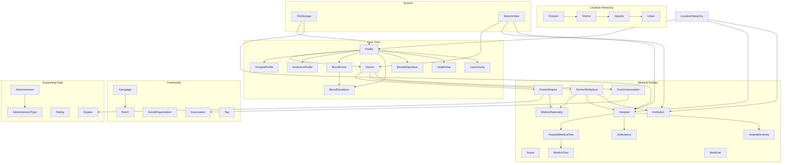

```mermaid
flowchart TD
    subgraph "Location Hierarchy"
        Division --> District --> Upazila --> Union
    end

    subgraph "User Core"
        Profile --> Doctor
        Profile --> HospitalProfile
        Profile --> InstitutionProfile
        Profile --> BloodDonor
        Profile --> BloodDonations
        Profile --> BloodRequisition
        Profile --> HealthVital
        Profile --> UserActivity
    end

    subgraph "Medical Entities"
        Hospital --> HospitalMedicalTest
        Hospital --> Ambulance
        Hospital --> HospitalAmenity
        Institution
        Nurse
        Doctor --> DoctorDegree
        Doctor --> DoctorWorkplace
        Doctor --> DoctorAssociation
        MedicalSpeciality
        MedicalTest
        Medicine
    end

    subgraph "Community"
        Association
        SocialOrganization
        Campaign --> Event
        Tag
    end

    subgraph "Supporting Data"
        Degree
        Rating
        Advertisement
        AdvertisementType
    end

    subgraph "System"
        FileStorage
        SearchIndex
    end

%% Key Relationships
    DoctorDegree --> Degree
    DoctorDegree --> MedicalSpeciality
    DoctorWorkplace --> MedicalSpeciality
    DoctorWorkplace --> Hospital
    DoctorWorkplace --> Institution
    DoctorAssociation --> Association
    HospitalMedicalTest --> MedicalTest
    BloodDonor --> BloodDonations
    LocationHierarchy --> Profile
    LocationHierarchy --> Hospital
    LocationHierarchy --> Institution
    Advertisement --> AdvertisementType
    SearchIndex --> Doctor
    SearchIndex --> Hospital
    SearchIndex --> Institution
    FileStorage --> Profile
    FileStorage --> Hospital
```
