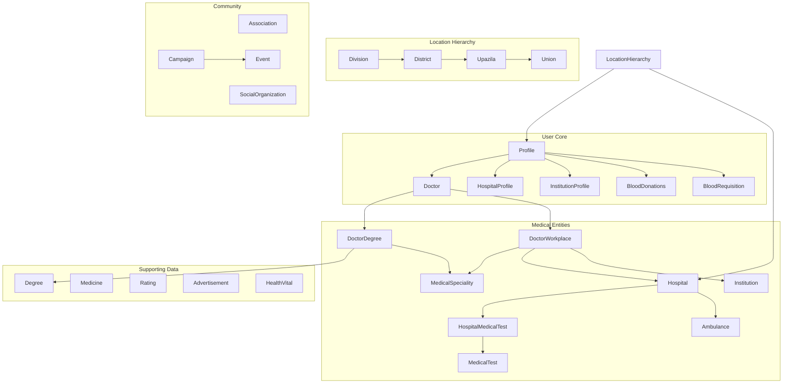

```mermaid
flowchart TD
    subgraph "Location Hierarchy"
        Division --> District --> Upazila --> Union
    end

    subgraph "User Core"
        Profile --> Doctor
        Profile --> HospitalProfile
        Profile --> InstitutionProfile
        Profile --> BloodDonations
        Profile --> BloodRequisition
    end

    subgraph "Medical Entities"
        Hospital --> HospitalMedicalTest
        Hospital --> Ambulance
        Institution
        Doctor --> DoctorDegree
        Doctor --> DoctorWorkplace
        MedicalSpeciality
        MedicalTest
    end

    subgraph "Community"
        Association
        SocialOrganization
        Campaign --> Event
    end

    subgraph "Supporting Data"
        Degree
        Medicine
        Rating
        Advertisement
        HealthVital
    end

%% Key Relationships
    DoctorDegree --> Degree
    DoctorDegree --> MedicalSpeciality
    DoctorWorkplace --> MedicalSpeciality
    DoctorWorkplace --> Hospital
    DoctorWorkplace --> Institution
    HospitalMedicalTest --> MedicalTest
    LocationHierarchy --> Profile
    LocationHierarchy --> Hospital
```